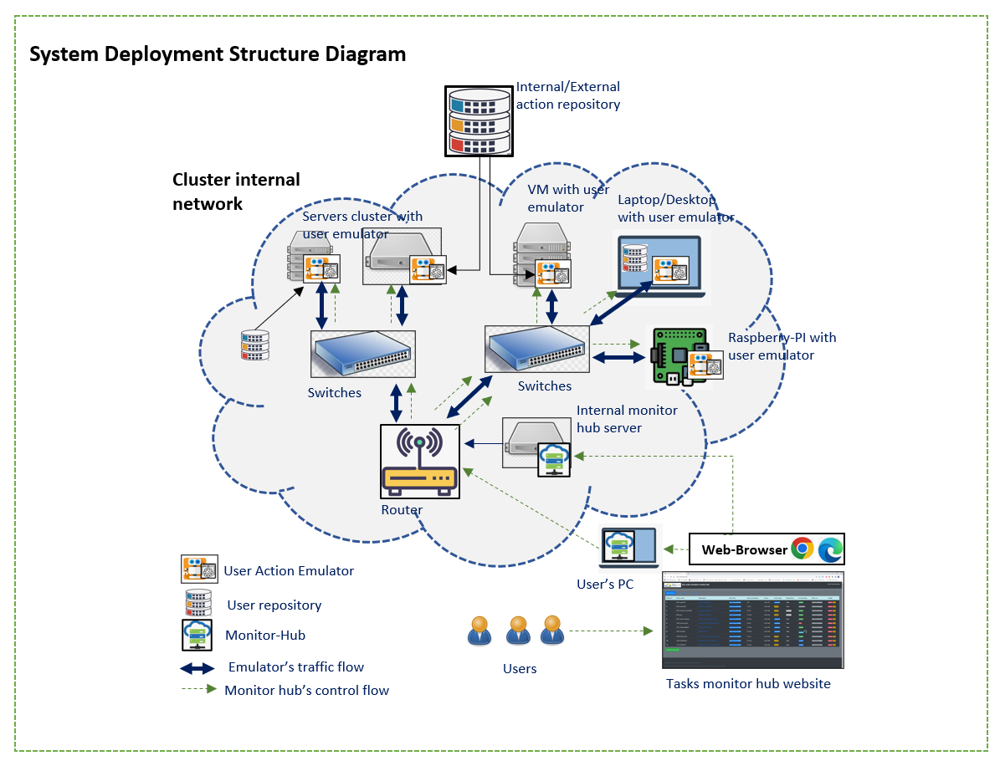
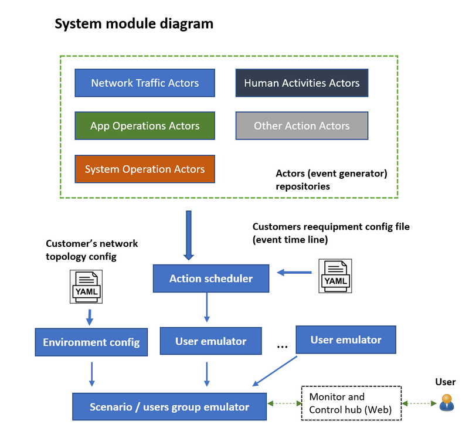
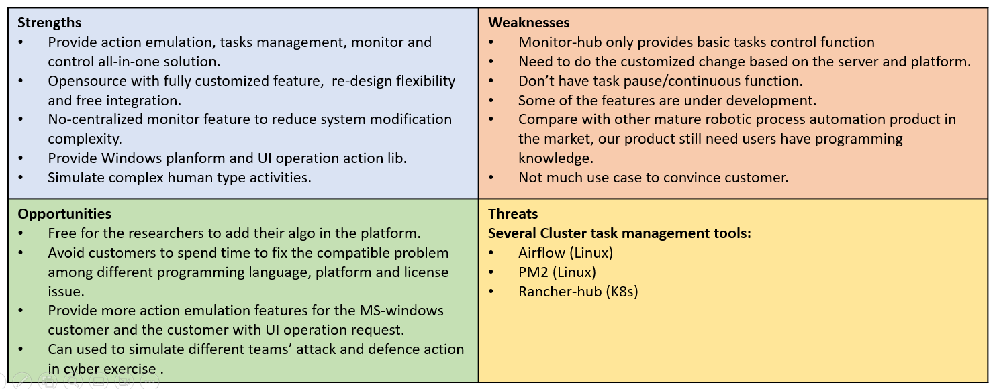
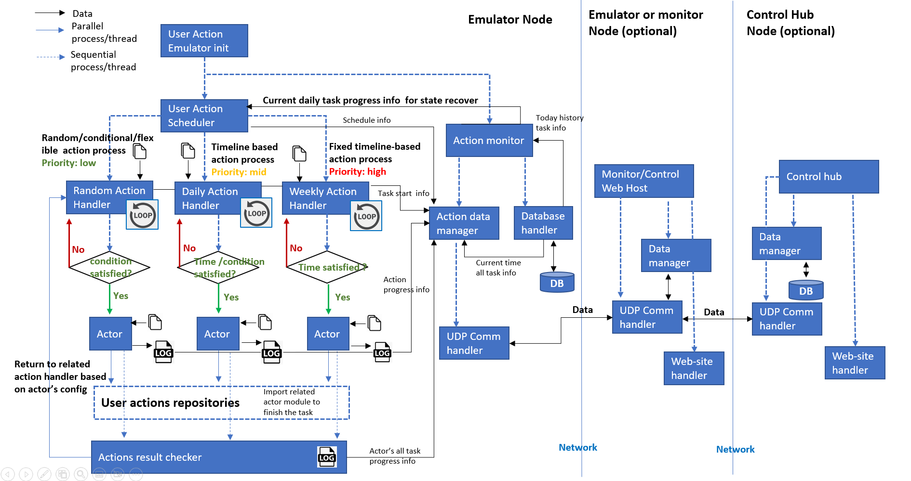
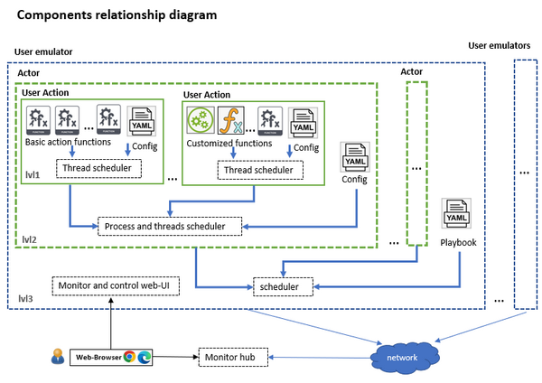
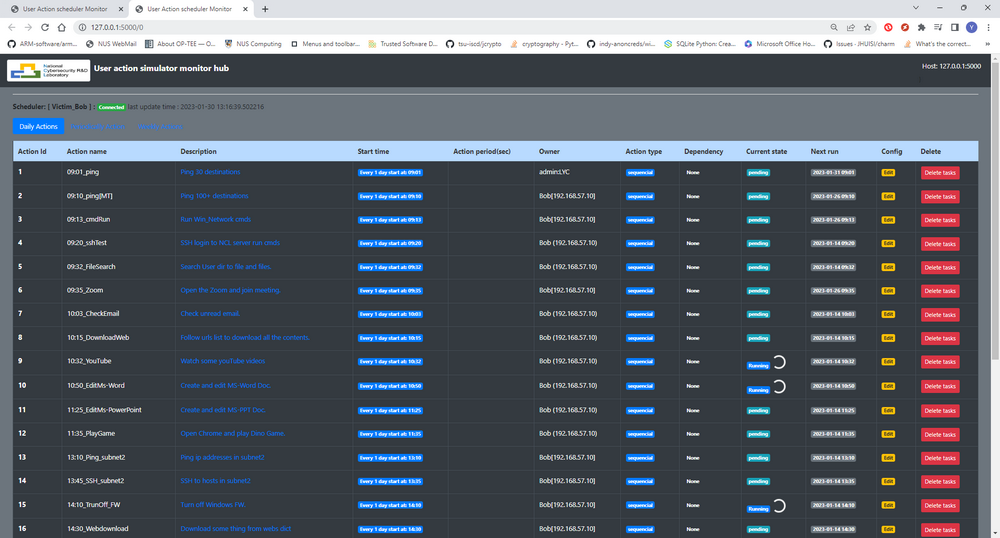

# Cluster User Emulation System

**Program Design Purpose**: We want to create a centralized controlled distributed user human activities emulation cluster system which can be used to simulate and monitor a mid size cluster of multiple users’ normal network traffic actions and the local activities events. The system can be applied to support below scenario : 

- Auto repeat/replay specified numbers of users (blue team) activities (benign-traffic) or or attack-action (red team) in cyber exercise event.
- Generate required network traffic flow with different network protocols for network security research project or network honeypot built. 
- Be used to build the repeatable users’ test environment for AI/ML trained model’s testing and verification.
- Provide library API for customer to build customized complex “Human type” action. 

[TOC]

------

### Introduction

The Cluster Users Emulator is a multiple users’ action emulation system running in a network/compute cluster system which can satisfy the customers’ requirement about:

- Network-traffic / node activities / group-users interactive action generation. 

- Robotic process / tasks automation. 

- System tasks’ process monitoring and control.

  

#### System structure 

The user Emulator system can be deployed on single compute node, real network system, VMs based SDN (software defined network). The product contents three parts, the “User actions repository”, the “User action emulator/scheduler” and the “scheduler monitor hub”. (The 3 parts relationship is shown in the below system deployment structure diagram)



- **User Actions Repository** : Provide the library APIs repository to simulate simple user’s normal activities/events under hardware, network, OS and App level. (Such as starting the online meeting, send/receive email, upload/download files, edit MS-Office doc, On/Off Windows FW, watch online/offline video…)
- **User Action Emulator**: A RPA type scheduler to invoke the lib from action repository to build more complex “Human type” activities and run the tasks based on the users’ timeline playbook configuration.
- **Scheduler Monitor Hub**: A no-centralized monitor website host which provides plug and play tasks state view function for the customer to monitor and control all/parts of their schedulers in a computers/servers cluster. 

The modules relationship diagram is shown below: 



`Version: 0.1`

------

### Product overview 

There are several kinds of well-developed network traffic generators, task scheduler tools and the tasks progress monitors hub in the market. But most of these tools’ functions are very general and don’t cover all the three areas ( emulation, management and monitoring), so the customer still speed a lot of time and effort to build their system. Our Cluster Users Emulator is aimed to provide a packaged all-in-one light solution allow our customers to simulate a groups of different users’ complex human type action, then schedule these events and monitor / control them without spending much workload to play with several different tools. 

#### SWOT Business Analysis



##### **Who may be interested about using it:** 

- Customers whose system config setting and requirements keep updating, or need flexible tool to integrate different apps. 
- Customer who wants to create some complex “human type” action especially related UI operation and Windows platform.
- Customer who needs different kinds of pre-configured activities scenario and try to avoid spending much development effort on the events/traffic generation details. 
- Researcher who want to automatically repeat specific scenario with small changes for their experiments.

##### **Why user choose using it :** 

- **Open** : Our product is open source and focuses on more specific activities generation tasks, so compare with other general tools, our product is more suitable for the customer to create complex scenario. 
- **Reusable**: Our product can provide activities library for customer to reuse and integrate to their software/program. 
- **Flexible**: Our pre-build user cluster’s activities scenario can be easily changed to match customers’ requirement to help reduce the customer’s development effort. 

##### **User Action emulator demo video:** 

- https://www.youtube.com/watch?v=jgm3gQhzUq4&t=57s
- https://www.youtube.com/watch?v=wZsRmYPcPTQ


------

### System Design

We want to create an intelligent "actor” program which can simulate a normal MS-Windows user’s daily action ( different kinds of network access, system level operation and different app level operation) to generate user’s regular or random event based on the customer’s requirement. So, it can:

- Be used to repeat/replay specified large numbers of users (blue team) activities in cyber exercise event.
- Generate required network traffic flow for network security research project. 
- Be used as repeatable user’s test environment for AI/ML trained module’s verification.

##### System Work Flow Diagram

The system will work under the below work diagram 




#### User Actions Repository

User Actions Repository is library APIs repository to simulate simple user’s normal activities/events under hardware, network, OS and App level. (Such as starting the online meeting, send/receive email, upload/download files, edit MS-Office doc, On/Off Windows FW, watch online/offline video…)

Currently we provide 5 main repositories with 18 kinds of basic user action functions and 28 kinds of pre-built complex user’s actors components. The 5 main feature repositories covers: 

- Network traffic action generators. 
- Application operation action generators. 
- User’s human activities action generators.
- System control action generators.
- Other action generators.

**The detail document link of User Action Repository** [click [here](ReadMe_User_Actions_Repository.md) ] 


#### **User Action Emulator**

User Actor Emulator is a RPA type scheduler to invoke the lib from action repository to build more complex “Human type” activities and run the tasks based on the users’ timeline playbook configuration. The emulator program provides four levels of components to build/implement the customers requirement: 

- **Basic action function[lvl-0] :** Do one basic action such as file send tcp request, file copy, run cmd. 
- **User action [lvl-1]:** Grouped basic functions with a schedule config file to implement complex user’s action such read and write email, join a zoom meeting. 
- **Actor [lvl-2]:** Grouped user actions with a schedule config file to implement human normal activity such as edit a PPT and share to the cloud, play a sample game, surf the internet and download the contents. 
- **User emulator [lvl-3]:** Schedule the actors with a customized timeline so the emulator can implement a specific user’s daily event, such as a network admin.

The components relationship is shown below:



**The detail document link of  User Action Emulator** [click [here](ReadMe_User_Actions_Emulator.md) ] 


#### **Scheduler Monitor Hub**

The Scheduler Monitor hub is a no-centralized monitor website host which provides plug and play tasks state view function for the customer to monitor and control all/parts of their schedulers in a computers/servers cluster. The emulator's task monitor Page/ tasks view is shown below:



The scheduler monitor hub program provide a website for the customer to check each user emulator’s tasks execution state and do some basic control**.** As shown in the workflow diagram section, the user can connect to the monitor hub server to view the webpage or plug their own laptop in the cluster to “Fetch” the emulators’ state basic their local setting.

**The detail document link of  Scheduler Monitor Hub** [click [here](ReadMe_User_Actions_Emulator.md) ] 


------

### Program Setup [under editing]

###### Development Environment : python 3.7.4

Additional Lib/Software Need: 

###### Hardware Needed : None

###### Program  Folder Structure;


######  

------

### Program Usage


#### Program Execution 

##### User action Emulator

Your can use program execution 1 or program execution 2

- Program execution 1: Run `src/runScheduler_win.bat`
- Program execution 2: cd to `src/actionScheduler` run `python ScheduleRun.py`

##### Scheduler Monitor Hub

Your can use program execution 1 or program execution 2

- Program execution 1: Run `src/runMonitor_win.bat`
- Program execution 2: cd to `src/monitorHub/frontend` run `python app.py`


remove access the windows vm:

```
ssh -L 127.0.0.1:3389:192.168.57.10:3389 -p 6022 -J rp_fyp_ctf@gateway.ncl.sg ls23@172.18.178.10
```


------

### Program Use Case 


------

> Last edit by LiuYuancheng(liu_yuan_cheng@hotmail.com) at 03/02/2023, if you have any problem or find anu bug, please send me a message .