# Cluster User Activities Emulation System (CUE)

**Project Design Purpose** : The Cluster User Activities Emulation (CUE) System is a distributed, automated, and reusable toolkit designed to generate both benign and malicious user activities across a simulated network environment (such as a cyber exercise cluster). The primary objective of the project is to emulate realistic cyber environments by creating human-like user behavior, network traffic, system events, and attack activities that can be customized for a wide range of cybersecurity research, education, testing, and operational scenarios.

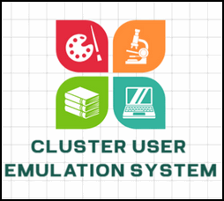

Unlike traditional traffic generators that only produce network packets, CUE focuses on behavior-driven activity emulation, enabling the simulation of complete user workflows, attacker operations, and defender responses across multiple hosts. This approach creates realistic datasets and system interactions that are valuable for Digital Forensics and Incident Response (DFIR), cyber range exercises, security validation, and malware research. This toolkit is designed to fulfill the following requirements:

- Simulation of a mid size of cluster/network with active users (generate human activities) for DFIR data collection. 
- Simulation of red team attacks or recurrent attack scenarios in cyber exercise/events.
- Simulation of blue team defense activities or the creation of live honeypots. 
- Provide real time monitoring and management interface of cyber exercise management team. 
- Automated to do regular penetration test or stress test for a system or service. 
- Assistance in cyber-security education and professional training. 
- Building the customizable malware for researching purposes. 

By meeting these objectives, our toolkit aims to enhance cybersecurity preparedness, training, and research efforts by providing comprehensive and adaptable functionalities.

```python
# Author:      Yuancheng Liu
# Created:     2024/01/20
# Version:     v_0.2.3
# Copyright:   Copyright (c) 2026 LiuYuancheng
# License:     GNU Lesser General Public License v3.0
```

**Table of Contents**

[TOC]

- [Cluster User Emulation System (CUE)](#cluster-user-emulation-system--cue-)
    + [Introduction](#introduction)
      - [System Structure](#system-structure)
    + [Project Design](#project-design)
      - [Design of System Work Flow](#design-of-system-work-flow)
        * [Benign Activities and Traffic Generation](#benign-activities-and-traffic-generation)
        * [Malicious Activities and Traffic](#malicious-activities-and-traffic)
      - [Design of Activities Generation Modules Repository](#design-of-activities-generation-modules-repository)
      - [Design User Action Emulator](#design-user-action-emulator)
      - [Design of System Orchestrator](#design-of-system-orchestrator)
    + [System Deployment and Execution](#system-deployment-and-execution)
      - [System Deployment](#system-deployment)
      - [System Execution Flow](#system-execution-flow)
    + [Business Overview](#business-overview)
        * [Who Might Benefit from Using It:](#who-might-benefit-from-using-it-)
        * [Why user choose using it :](#why-user-choose-using-it--)
    + [Program Setup](#program-setup)
      - [Detail Setup Steps](#detail-setup-steps)
    + [Program Usage](#program-usage)
        * [Run User Action Emulator](#run-user-action-emulator)
        * [Run Scheduler Monitor Hub](#run-scheduler-monitor-hub)
    + [Problem and Solution](#problem-and-solution)


------

### 1. Project Introduction

The **Cluster User Emulation (CUE)** System is a distributed user behavior and activity emulation platform designed to simulate realistic user, device, and attacker behaviors across multiple hosts within a network or compute cluster. Unlike conventional traffic generators that only produce network packets, CUE emulates complete user workflows by combining operating system interactions, application usage, network communications, and automated attack or defense activities.

The platform enables researchers, instructors, security engineers, and penetration testers to construct repeatable and configurable cyber environments that closely resemble real enterprise networks. By orchestrating multiple emulation agents simultaneously, CUE can generate realistic background activities, execute complex attack scenarios, and produce comprehensive datasets for Digital Forensics and Incident Response (DFIR), AI/ML model validation, cybersecurity training, and cyber range exercises.

#### 1.1 System Main Features

The CUE System provides the following core capabilities:

- **Extensible Activity Repository** – A reusable library of both **benign** and **malicious** activity plugins that allows users to build customized Human, Device, Insider, or Hacker behavior models.
- **Automated User Action Emulation** – Supports robotic process automation (RPA)-style execution, scheduled tasks, randomized user activities, and repeatable Red Team attack paths or Blue Team defense procedures.
- **Network Traffic Generation** – Produces realistic network traffic using multiple communication protocols for penetration testing, service stress testing, protocol validation, and network security research.
- **Centralized Monitoring and Management** – Provides a web-based management platform for monitoring emulator status, task execution progress, node health, generated traffic, and group-user interactions across the cluster.
- **Repeatable AI/ML Test Environment** – Generates reproducible datasets containing user activities, operating system events, application logs, and network traffic for developing, training, and validating cybersecurity AI/ML models.

**1.1.1 System Feature Demo Video**

With the above versatile capabilities, the Cluster User Emulation system proves invaluable for cybersecurity exercises, research projects, AI/ML testing, and process automation.

> **User Action Emulator Demo Videos**
>
> - **Video-01:** https://www.youtube.com/watch?v=jgm3gQhzUq4&t=57s
> - **Video-02:** https://www.youtube.com/watch?v=wZsRmYPcPTQ

#### 1.2 System Structure and Overview 

The Custer User Emulator System contents three main parts, the `Activities Generation Modules Repository`, the `Users Action Emulator` and the `System Status Orchestrator` as shown blow :

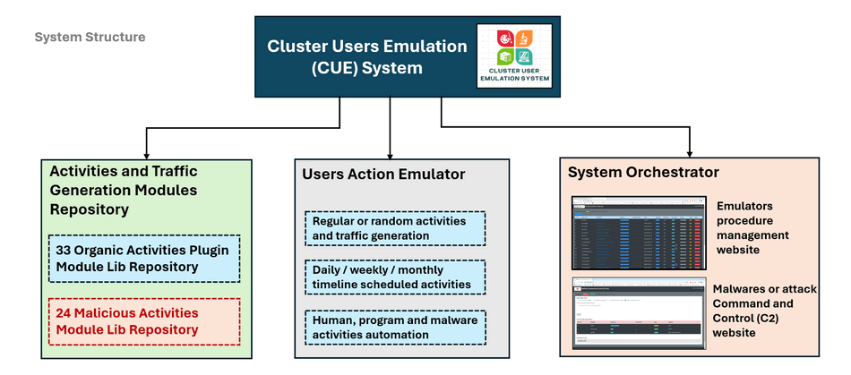

**1.2.1 Activities and Traffic Generation Modules Repository**

The Activities Generation Modules Repository is a collection of library modules for generating both benign and malicious activities and traffic:

- **Organic Activities Repository** – Currently contains **33** plugin modules that emulate legitimate user (blue team) operations, application usage, file access, web browsing, email communication, network services, and other daily activities.
- **Malicious Activities Repository** – Currently contains **24** plugin modules that simulate attacker (read team) behaviors, malware execution, command-and-control (C2) communication, privilege escalation, persistence techniques, lateral movement, and other offensive security activities.

**1.2.2 User Action Emulator Module**

The **User Action Emulator** is the execution engine responsible for running activity plugins on target machines. It assembles selected modules from the repository into configurable workflows and executes them according to user-defined schedules or randomized timelines, the main function includes: 

- Continuous or randomized background activity generation
- Daily, weekly, or monthly scheduled tasks
- Automated human, software, and malware behavior simulation
- Repeatable attack replay for Red Team exercises
- Automated defensive actions for Blue Team training

**1.2.3 System Centralized  Orchestrator**

The **System Orchestrator** is the centralized management server responsible for coordinating all distributed User Action Emulators within the cluster. It continuously collects execution status, activity logs, resource utilization, and communication statistics from each emulator, providing operators with a unified web-based management interface for monitoring and controlling the entire environment. The main function includes: 

- Centralized task scheduling and deployment
- Activity execution monitoring
- Cluster node status management
- Emulator configuration management
- Malware and Command-and-Control (C2) management interface
- Real-time visualization of emulator activities and execution progress


------

### 2. System Design and Workflow

The CUE System follows a modular design philosophy, allowing activity modules, user roles, execution playbooks, and emulation nodes to be independently developed, reused, and combined to create realistic cyber environments.

#### 2.1 System Workflow

The overall workflow of the CUE System consists of five sequential stages, as illustrated below.

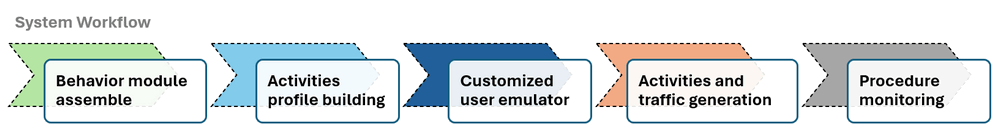

**2.1.1 Step 1 – Behavior Module Assembly**

- The workflow begins by user selecting needed plugin modules from the **Activities Generation Modules Repository**. 
- Then the users choose the API with the related activity modules, communication protocols, application behaviors, operating system actions, and attack modules to build a desired user profile.

**2.1.2 Step 2 – Activity Profile Construction**

- After the required modules have been selected, they are assembled together with one or more **playbooks** to form a complete activity profile.
- Then set the activity profile define parameters such as : User role (Engineer, HR Officer, Customer, Device, etc.), Activity sequence, Execution timeline, Randomization rules, Network behavior, Scheduled tasks

**2.1.3 Step 3 – Customized User Emulator Generation**

- The generated profile package is imported into a User Action Emulator, transforming the generic emulator into a customized role-specific execution agent.
- Each emulator behaves independently according to its assigned profile and can represent different entities within a cyber range, including:

**2.1.4 Step 4 – Activity and Traffic Generation**

- After deployment, the emulator executes the playbook according to its configured schedule.
- Activities can be executed continuously, periodically, randomly, or according to predefined timelines, allowing the system to closely resemble real enterprise user behavior.

**2.1.5 Step 5 – Procedure Monitoring**

- Throughout execution, every emulator continuously reports its execution status, activity progress, generated traffic statistics, and health information to the **Cloud Orchestrator**.
- The orchestrator provides visualization of the  emulator status, execution progress, execution logs and the control function for start or stop activity profiles, deploy new playbook. 


#### 2.2 Benign Activities and Traffic Generation 

The benign activity generation process begins with selecting reusable activity modules from the **Organic Activities Plugin Repository**, which currently contains over **33** modules covering common enterprise behaviors. These modules are organized into categories including network communications, application usage, human interactions, and operating system activities.

The detailed workflow for generating legitimate user activities is shown below : 

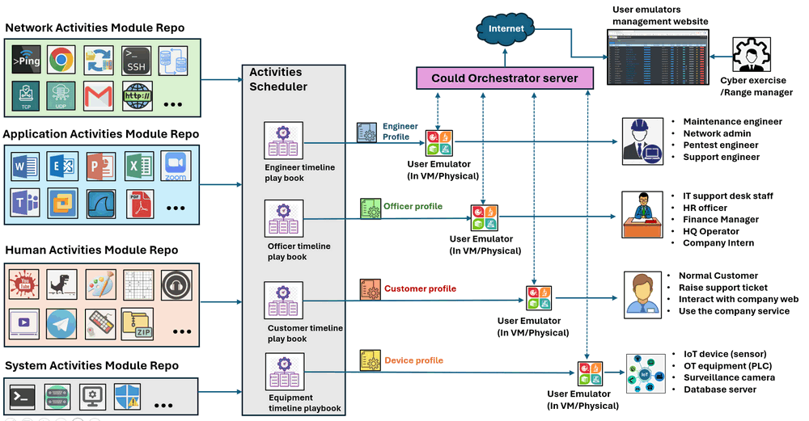

By assigning different playbooks and profiles, the CUE System can emulate a wide range of users and devices commonly found in enterprise and industrial environments.

**2.2.1 IT and OT Specialists**

| Function Description                                         | Simulated Roles                                              | Simulated activities                                         |
| ------------------------------------------------------------ | ------------------------------------------------------------ | ------------------------------------------------------------ |
| Simulates technical personnel responsible for maintaining enterprise and industrial infrastructure | Maintenance Engineers, Network Administrators, Penetration Test Engineers, IT Support Engineers, Network Administrators | SSH login, PLC programming, database maintenance, network diagnostics, software deployment, and remote administration |

**2.2.2 Enterprise Office Staff**

| Function Description                                         | Simulated Roles                                              | Simulated activities                                         |
| ------------------------------------------------------------ | ------------------------------------------------------------ | ------------------------------------------------------------ |
| Daily office employees performing routine business operations | Human Resources Officers, Finance Managers, Finance Managers, Headquarters Operators, Company Interns | Doc editing, spreadsheet processing, presentation preparation, email communication, file sharing, printing, web browsing, and video conferencing. |

**2.2.3 Customer Activities**

| Function Description                                | Simulated Roles | Simulated activities                                         |
| --------------------------------------------------- | --------------- | ------------------------------------------------------------ |
| External users interacting with enterprise services | Normal Users    | Accessing company websites, Registering user accounts, Raising support tickets, Using online services, Downloading resources |

**2.2.4 Device Emulation**

| Function Description                                | Simulated Roles                                              | Simulated activities                                         |
| --------------------------------------------------- | ------------------------------------------------------------ | ------------------------------------------------------------ |
| Emulate autonomous devices and industrial equipment | IoT sensors, PLCs and RTUs, Surveillance cameras, Database servers, Edge computing devices | Protocol-specific traffic and operational behaviors that closely resemble real-world deployments. |

#### 2.3 Malicious Activity and Traffic Generation

Besides generating normal enterprise activities, the CUE System can also emulate adversarial behaviors, malware execution, and automated cyber attacks. The malicious activity workflow is shown below.

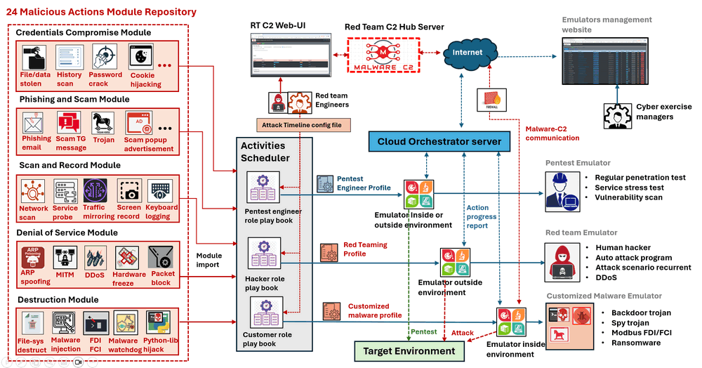

Different attacker profiles can represent human hackers, automated attack tools, malware samples, or command-and-control (C2) agents.

**2.3.1 Penetration Testing**

| Function Description                                         | Simulated Roles  | Simulated activities                                         |
| ------------------------------------------------------------ | ---------------- | ------------------------------------------------------------ |
| Validate security controls and identify weaknesses before production deployment | Pentest engineer | Network vulnerability scanning, Service enumeration, Authentication testing, Service stress testing |

**2.3.2 Red Team Operations**

| Function Description                                         | Simulated Roles                     | Simulated activities                                         |
| ------------------------------------------------------------ | ----------------------------------- | ------------------------------------------------------------ |
| Attack playbooks can reproduce sophisticated offensive campaigns involving multiple stages of the cyber kill chain. | Red team attacker. simulated hacker | Initial access, Credential harvesting, Privilege escalation, Lateral movement, Persistence establishment, Command-and-Control (C2) communication, Data exfiltration, Distributed Denial-of-Service (DDoS) attacks |

**2.3.3 Customized Malware Emulation**

| Function Description                                         | Simulated Roles               | Simulated activities                                         |
| ------------------------------------------------------------ | ----------------------------- | ------------------------------------------------------------ |
| Simulate malware behaviors without requiring live malware samples. | Malware and Malicious payload | Remote Access Trojans (RATs), Backdoor Trojans, Spyware, Ransomware, Modbus False Data Injection (FDI) |


------

### 3. Design of Activities Generation Modules Repository

The **Activities Generation Modules Repository** provides an extensible collection of reusable plugin modules that generate both benign and malicious activities across multiple layers of a computing environment. The repository follows a plugin-based architecture, allowing new activity modules to be developed and integrated independently without modifying the core emulator. Each plugin encapsulates a specific activity or behavior and can be combined with other plugins through user-defined playbooks to construct complex, repeatable workflows.

Typical activities supported by the repository include:

- Sending and receiving emails
- Joining online meetings
- Uploading and downloading files
- Editing Microsoft Office documents
- Web browsing and online searches
- Playing online or offline multimedia
- Executing command-line utilities
- Managing databases and remote servers
- Enabling or disabling Windows Firewall
- Transferring files through various network protocols
- Executing scheduled background tasks
- Simulating industrial control system communications

#### 3.1 Organic Activities Plugin Repository

The **Organic Activities Plugin Repository** contains **33** reusable plugin modules that emulate legitimate day-to-day activities performed by enterprise users, administrators, and devices. These modules generate realistic operating system events, application logs, and network traffic, providing valuable datasets for Digital Forensics and Incident Response (DFIR), cybersecurity training, AI/ML research, and cyber range exercises.

**3.1.1 Network Activities Generation Plugins (11 Modules)**

These modules generate network communications using common enterprise protocols and services.

- Typical examples include: `[01] ICMP (Ping)`, `[02] HTTP / HTTPS`, `[03] FTP / SFTP` , `[04] SSH`, `[05] Email protocols (SMTP, POP3, IMAP)`, `[06] TCP and UDP communications`, `[07] Database connections`, `[08] Remote service access`, `[09] Web API interactions`, `[10] DNS and network diagnostics`, `[11] Custom protocol simulation`. 

**3.1.2 Application and Software Interaction Plugins (9 Modules)**

These plugins automate interactions with commonly used desktop and enterprise applications.

- Example activities include: `[01] Microsoft Word document editing`, `[02] Microsoft Excel spreadsheet processing`, `[03] Microsoft PowerPoint presentation editing`, `[04] PDF viewing`, `[05] Microsoft Teams collaboration`, `[05] Remote Desktop usage`, `[06] Web browser automation`, `[07] Database management software`, `[08] Third-party desktop applications`.

**3.1.3 Human Operation Plugins (8 Modules)**

Human operation plugins emulate the actions of real users interacting with their workstations.

- Typical activities include: `[01] Keyboard and mouse operations`, `[02] Web browsing`, `[03] Watching online or offline videos`, `[04] Instant messaging`, `[05] File copying and compression`, `[06] Downloading software`, `[07] Opening folders and documents`, `[08] Manual application operations`. 

**3.1.4 System Activity Plugins (5 Modules)**

System activity plugins interact directly with the operating system and system services.

- Example activities include: `[01] Command Prompt execution`, `[02] Windows service management`, `[03] Windows Firewall configuration`, `[04] System configuration changes`, `[05] Operating system maintenance tasks`.

#### 3.2 Malicious Activities Plugin Repository

The **Malicious Activities Plugin Repository** currently contains **24** plugin modules designed to emulate adversarial behaviors, cyber attacks, and malware operations within isolated environments. Rather than deploying real malware, these plugins safely reproduce attack techniques and malicious traffic patterns for cybersecurity research, penetration testing, DFIR training, and defensive validation.

**3.2.1 Credential and Critical Data Compromise Plugins (4 Modules)**

These plugins simulate attacks targeting sensitive credentials and confidential information.

- Typical activities include: `[01] Password harvesting`, `[02] Credential dumping`, `[03] Sensitive file collection`, `[04] Data exfiltration preparation`. 

**3.2.2 Phishing and Scam Plugins (4 Modules)**

These plugins reproduce common social engineering attacks used by adversaries.

- Example simulations include: `[01] Phishing emails`, `[02] Malicious attachment delivery`, `[03] Fake login pages`, `[04] Scam website interactions`.

**3.2.3 Scan and Reconnaissance Plugins (5 Modules)**

These modules emulate reconnaissance activities commonly performed before launching an attack.

- Typical examples include: `[01] Network scanning`, `[02] Port scanning`, `[03] Host discovery`, `[04] Service enumeration`, `[05] Vulnerability scanning`. 

**3.2.4 Denial-of-Service Plugins (5 Modules)**

These plugins generate abnormal traffic intended to evaluate system resilience and defensive mechanisms.

- Supported simulations include: `[01] TCP flooding`, `[02] UDP flooding`, `[03] HTTP request flooding`, `[04] Connection exhaustion`, `[05] Service stress testing`.

**3.2.5 System Destruction Plugins (6 Modules)**

These plugins emulate destructive malware behaviors and post-compromise activities.

- Examples include: `[01] File encryption simulation`, `[02] File deletion`, `[03] Service termination`, `[04] System configuration modification`, `[05] Process termination`, `[06] Persistence and cleanup activities`. 

#### 3.3 Modular Design and Extensibility

The Activities Generation Modules Repository is designed to be **modular**, **extensible**, and **reusable**. Every activity is implemented as an independent plugin with a standardized interface, allowing developers to add new behaviors without affecting existing modules or the core emulator.

Multiple plugins can be assembled into **playbooks**, which define the execution order, timing, dependencies, and repetition rules for a specific user role or attack scenario. This modular composition enables users to rapidly create highly customized activity profiles ranging from ordinary office employees and industrial devices to sophisticated attackers and malware.

> **The detail document link of User Action Repository** [click [here](ReadMe_User_Actions_Repository.md) ] 


------

#### Design User Action Emulator 

The User Action Emulator serves as the activating agent, utilizing assembled plugin modules from the `Activities Generation Modules Repository` to execute tasks on the target machine according to a user-defined timeline. It consists of two main components module:

- **Activities Scheduler Module**: The Activities Scheduler interprets the user's task timeline configuration and selects plugin modules from the `Activities Generation Modules Repository` based on task type specifications. Subsequently, it constructs a "playbook" to organize the execution sequence of each task according to the scheduled timeline. Once all modules and the playbook are imported, the Activities Scheduler packages them into a single package ( emulator profile ) for execution by the Action Emulator module.

- **Action Emulator Module**: Each Action Emulator instance loads a user profile (generated by the scheduler module) and assumes the role required for simulation. It executes tasks based on the timeline configuration, saving the execution results in emulator local database and updating them to the Orchestrator server for user access. Depending on the timeline configuration, the Action Emulator can generate regular or random human, software, or malware activities and traffic on a daily, weekly, or monthly schedule.

The emulator program offers four levels of components to fulfill customer requirements as shown below:

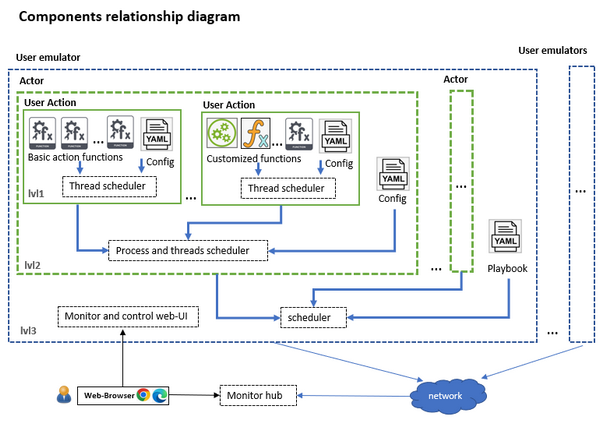

- **Basic Action Function [lvl-0]:** Performs individual basic actions, such as sending a file via TCP request, copying a file, or executing a command.
- **User Action [lvl-1]:** Groups basic functions with a schedule configuration file to execute complex user actions, such as reading and writing emails or joining a Zoom meeting.
- **Actor [lvl-2]:** Combines user actions with a schedule configuration file to mimic normal human activities, such as editing a PowerPoint presentation and sharing it to the cloud, playing a game, browsing the internet, and downloading content.
- **User Emulator [lvl-3]:** Schedules actors with a customized timeline, enabling the emulator to replicate specific daily events of a particular user role, such as a network administrator.

By offering these hierarchical levels of components, the User Actor Emulator provides a flexible framework for building and implementing diverse user scenarios, catering to a wide range of customer requirements.

> **The detail document link of  User Action Emulator** [click [here](ReadMe_User_Actions_Emulator.md) ] 


#### Design of System Orchestrator

The System Orchestrator is a cloud-based server that aggregates all User Action Emulator task execution states and offers a management website interface for users to monitor and manage the User Action Emulators. The Orchestrator provides two distinct web interfaces:

- **Emulator Procedure Management Interface**: This web dashboard displays comprehensive information about all connected emulators, including their current state and task details. Users can efficiently oversee the execution of tasks across multiple emulators from this interface.
- **Malware Command and Control Interface**: This web dashboard presents the task execution states of all connected malware instances and offers a web API for the red team to dynamically control the malware. This interface empowers red team members with the flexibility to manage malware operations effectively in real-time.

 The emulator's task monitor Page/ tasks view is shown below:

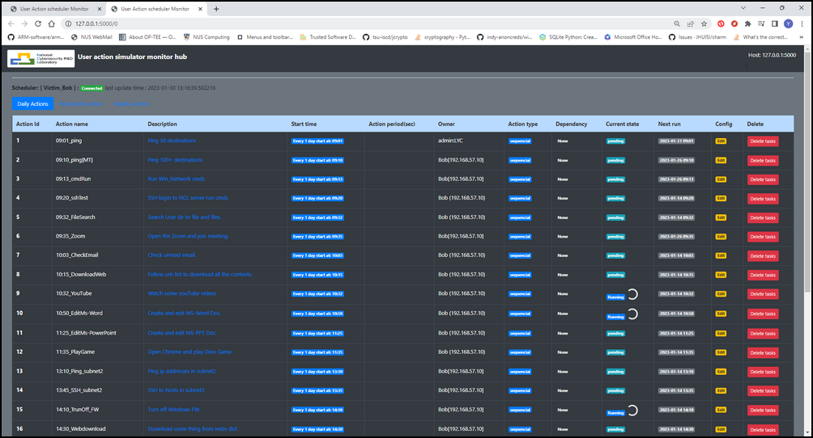

**Emulator’s action monitor web feature:** 

- User can monitor the scheduled actions(events) execution state from the monitor web.
- User can remove/deactivate the action from the web. 
- The web provide regular action (daily/weekly action) and random action monitoring. 
- (Under development) user can add new action/edit the actions from the Web interface**.**

> **The detail document link of  Scheduler Monitor Hub** [click [here](ReadMe_User_Actions_Emulator.md) ] 


------

### System Deployment and Execution 

This section will introduce who to deploy the emulation system in the network and the system execution flow.

#### System Deployment

The Cluster Emulator System can be deployed on various platforms, including a single/multiple compute node, IoT devices, a real network system, or VMs based SDN (Software Defined Network), as illustrated in the diagram below.

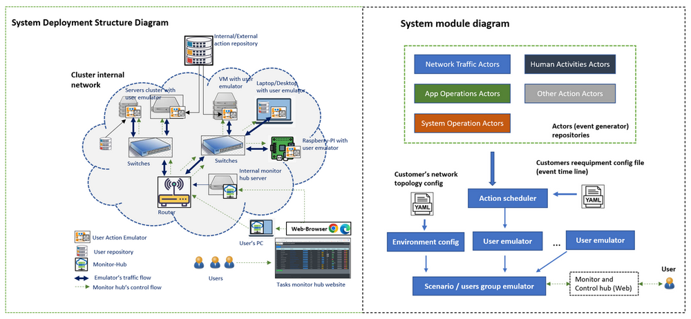

The `Activities Generation Modules Repository` can be deployed remotely in a database server in the network or local in every node for modules import, this enables easy access and utilization by the cluster emulation system.

The `User Action Emulator` requires deployment on the cluster's node computers or VMs to ensure seamless integration and execution within the emulation environment. For deploying each emulator, normally the profile package will contents below files:

- `setup.bat` : The script to install the needed software and the related lib to the target machine. 
- `scheduleCfg.txt`: The Emulator program config file includes the program execution parameters such as the DB path,  Orchestrator IP address and so on. 
-  `actorFunctions<xxxxx>.py`: The functions to import the Activities Generation Modules to do the task. 
- `scheduleProfile_<xxxxxx>.py`: The module contents the timeline for schedule the task execution.

The `Orchestrator Webserver` can be deployed either on the cloud or within the cluster itself, providing centralized management and coordination of the emulation activities. This flexibility allows for efficient orchestration regardless of the deployment environment's specifics.


#### System Execution Flow

The system will work under the below work diagram : 

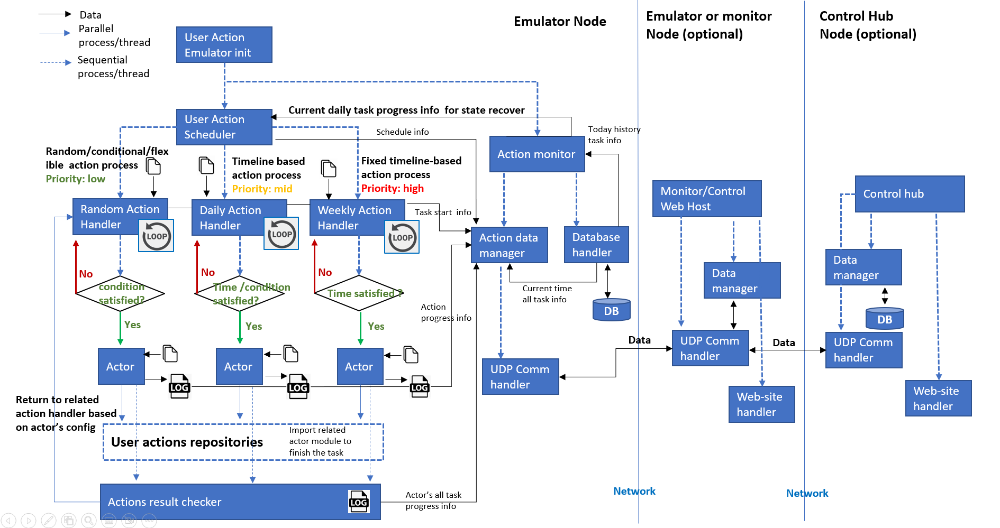

The key features of the execution flow:

- The User Emulator program is a multi-threaded application. Upon initialization, it spawns a sub-thread data manager responsible for fetching execution history from its local database and updating the state to the Orchestrator server.
- The main thread orchestrates three handler threads to concurrently manage random, daily, and weekly task lists.
- When the main scheduler detects a task with a timestamp matching the current time, the corresponding handler thread initiates a new sub-actor thread to import the necessary module and execute the task.
- Upon task completion, the result checker gathers logs and stores them in the data manager's database. Subsequently, the emulator regularly updates its latest task execution state to the Orchestrator, adhering to user-defined settings.


------

### Business Overview 

While the market offers various network traffic generators, task scheduler tools, and task progress monitors, many lack comprehensive coverage across all three areas: emulation, management, and monitoring. Consequently, customers often expend significant time and effort building their systems. Our Cluster Users Emulator aims to address this challenge by providing an all-in-one, lightweight solution. Our product enables customers to simulate diverse human-like actions, schedule events, and monitor/control them without the need for multiple tools.

**SWOT Business Analysis**

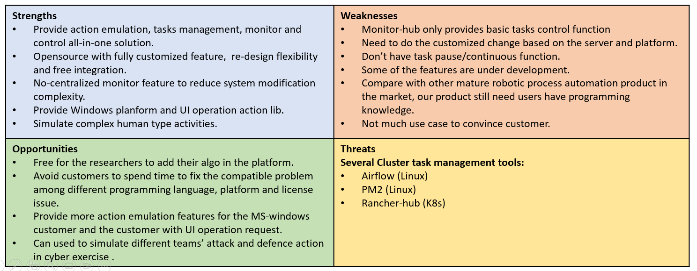

##### Who Might Benefit from Using It:

- **Dynamic Configurations**: Customers with evolving system configurations or those requiring a flexible tool to integrate different applications can benefit.
- **Complex User Actions**: Users seeking to create complex human-like actions, especially those involving UI operations and the Windows platform, will find value in our product.
- **Efficiency Seekers**: Customers looking for pre-configured activity scenarios to minimize development efforts on event/traffic generation details.
- **Researchers**: Researchers desiring to automatically replicate specific scenarios with minor variations for experiments can leverage our product.

##### Why user choose using it : 

- **Open** : Our product is open source and focuses on more specific activities generation tasks, so compare with other general tools, our product is more suitable for the customer to create complex scenario. 
- **Reusable**: Our product can provide activities library for customer to reuse and integrate to their software/program. 
- **Flexible**: Our pre-build user cluster’s activities scenario can be easily changed to match customers’ requirement to help reduce the customer’s development effort. 


------

### Program Setup 

Development Environment : python 3.7.4

Additional Lib/Software Need: 

```
beautifulsoup4
keyboard
mouse
numpy
paramiko
Pillow
PyAutoGUI
pythonping
requests
schedule
selenium
pyscreenshot
python-nmap
pynput
scp
```

Hardware Needed : None

#### Detail Setup Steps

This is a profile package example (a profile to simulate the maintenance OT engineer):

 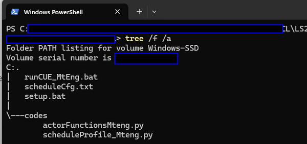

Follow the below steps to setup the cue on a node (Windows OS):

1. Git clone the repository in a folder in the target machine/vm. 
2. Copy the auto execution run script `runCUE_MtEng.bat` under folder  `C:\Users\xxxx\AppData\Roaming\Microsoft\Windows\Start Menu\Programs\Startup` 
3. Install the lib module via run the `setup.bat` .
4. Copy all the *.py files in `codes` folder and `scheduleCfg.txt` to the `Windows_User_Simulator\src\actionScheduler`


------

### Program Usage

To use the User Emulation Program, follow the c template to set the configuration file: 

```
# This is the config file template for the module <ScheduleRun.py>
# Setup the paramter with below format (every line follows <key>:<val> format, the
# key can not be changed):

# Add your connect peer under below format in one line:

#Set the OwnID
Own_ID:Test_Template

# Set the OwnIP address
OWN_IP:127.0.0.1

# Setup the host UDP port here.
# Format HOST_PORT:<int>
HOST_PORT:3001
# HOST_PORT:3002 # Alice test use port 3002

# Set the report Mode (If the schdule is not in the hub list, set the flag to true and config the 
# hub ip address, the schudler will auto register to the hub when it start)
RPT_MD:True
HUB_IP:127.0.0.1
HUB_PORT:5000

# Set the actor profile's name here (the file will be import, example: if you 
# want to import file scheduleProfile_Bob.py as user profile, use scheduleProfile_Bob):
# Format: PROFILE:<python Module file Name>
PROFILE:scheduleProfile_template
# PROFILE:scheduleProfile_Alice
# PROFILE:scheduleProfile_Bob
# PROFILE:scheduleProfile_Charlie
```

##### Run User Action Emulator

Your can use program execution 1 or program execution 2

- Program execution 1: Run `src/runScheduler_win.bat`
- Program execution 2: cd to `src/actionScheduler` run `python ScheduleRun.py`

##### Run Scheduler Monitor Hub

Your can use program execution 1 or program execution 2

- Program execution 1: Run `src/runMonitor_win.bat`
- Program execution 2: cd to `src/monitorHub/frontend` run `python app.py`


------

### Problem and Solution

Refer to `doc/ProblemAndSolution.md`

------

> Last edit by LiuYuancheng (liu_yuan_cheng@hotmail.com) at 15/04/2024, if you have any problem or find anu bug, please send me a message .

