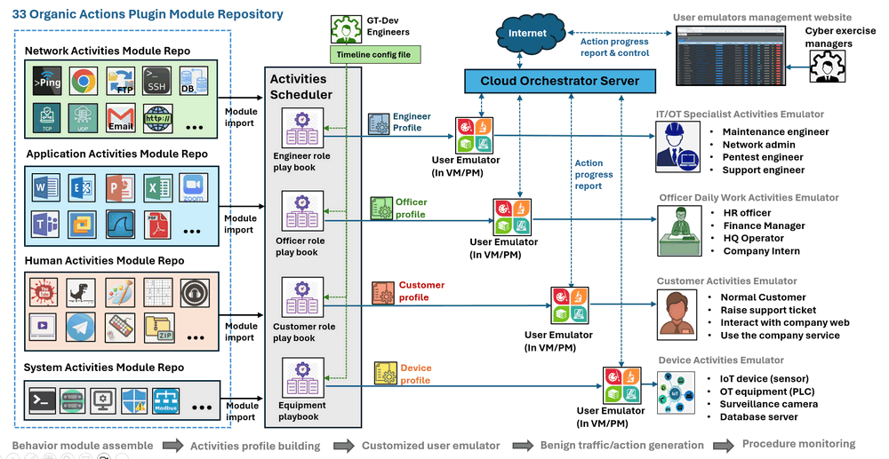
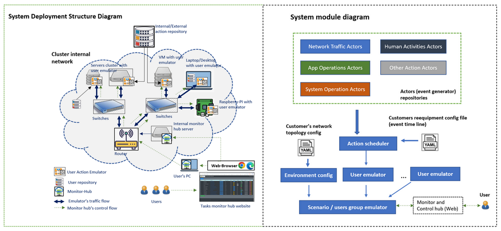

# Cluster User Emulation System (CUE)


**Project Design Purpose**: Our objective is to develop a distributed, automated, flexible and reusable toolkits set for generating both benign and malicious activities and traffic. This toolkit is designed to fulfill the following requirements:

- Simulation of a mid size of cluster/network with active users (generate human activities) for Digital Forensics and Incident Response (DFIR). 
- Simulation of red team attacks or recurrent attack scenarios in cyber exercise/events.
- Simulation of blue team defense activities or the creation of live honeypots. 
- Provide real time monitoring and management interface of cyber exercise management team. 
- Automated to do regular penetration test or stress test for a system or service. 
- Assistance in cyber-security education and professional training. 
- Building the customizable malware for researching purposes. 

By meeting these objectives, our toolkit aims to enhance cybersecurity preparedness, training, and research efforts by providing comprehensive and adaptable functionalities.

```
version:     v0.2.2
Copyright:   Copyright (c) 2024 LiuYuancheng
License:     MIT License   
```

**Table of Contents**

[TOC]

------

### Introduction

The Cluster User Emulation System operates within a network/compute cluster environment, simulating multiple users' actions and monitoring their network traffic and activities. This system serves various purposes, including:

- Providing a library repository with benign and malicious activities&traffic plugin module for customers to create customized complex "Human / Hacker / device" type actions.
- Providing automatically robotic processes and tasks (RPT) or repeating/replaying specified attacking path/scenario of red team and defense activities of blue team during cyber exercise/event.
- Generating network traffic flows with different protocols for target system penetration testing, service stress testing or using for network security research projects.
- Providing the management interface for monitoring and controlling the tasks, processes, network traffic, node activities, and group-users interactive actions.
- Establishing repeatable test environments for testing and verifying AI/ML trained models.

With its versatile capabilities, the Cluster User Emulation system proves invaluable for cybersecurity exercises, research projects, AI/ML testing, and process automation.

>  User Action Emulator Demo Video: [Video-01](https://www.youtube.com/watch?v=jgm3gQhzUq4&t=57s) , [Video-02](https://www.youtube.com/watch?v=wZsRmYPcPTQ)


#### System Structure 

The Custer User Emulator System contents three main parts, the `Activities Generation Modules Repository`, the `Users Action Emulator` and the `System Status Orchestrator` as shown blow:


The Activities Generation Modules Repository is a collection of library modules for generating both benign and malicious activities and traffic. The Organic repository comprises 33 different plugin modules and the Malicious repository contains 24 different plugin modules. 

The User Action Emulator serves as the activating agent, utilizing assembled plugin modules from the `Activities Generation Modules Repository` to execute tasks on the target machine according to a user-defined timeline.

The System Orchestrator is a cloud-based server that aggregates all User Action Emulator task execution states and offers a management website interface for users to monitor and manage the User Action Emulators


------

### Project Design 

This section will introduce the design of system workflow, the design of system execution in the cyber range and the design of the three project main section. 


#### Design of System Work Flow 

The system workflow consists of five main steps, outlined below:


1. **Behavior Module Assembly**: This step involves gathering library modules from the `Activities Generation Modules Repository` based on the user's configuration file.

2. **Activities Profile Building**: The gathered library modules and playbook files are packaged into a specific format profile, tailored for use by the emulator.

3. **Customized User Emulator**: The profile package is imported to the emulator to create a customized "Role" program, ensuring it behaves according to user specifications.

4. **Activities and Traffic Generation**: Upon execution, the emulator follows the playbook within the profile to generate relevant activities and traffic flow as per the user's requirements.

5. **Procedure Monitoring**: This step involves monitoring the progress of task execution to ensure tasks are carried out efficiently and effectively.

   

##### Benign Activities and Traffic Generation 

The detailed 5 steps workflow of the system generating the benign activities & traffic is shown below:



With varied playbook and profile configurations, the emulator can effectively emulate various types of users and devices within a cyber range, including:

- **IT/OT Specialists**: This category encompasses roles such as maintenance engineers, network administrators, penetration test engineers, and IT support engineers.
- **Company Officers' Daily Work**: Roles like HR officers, finance managers, HQ operators, and company interns fall under this category, simulating typical daily tasks within the organization.
- **Normal Customers**: Users in this category simulate typical customer interactions, such as raising support tickets, engaging with the company website, and utilizing company services.
- **Device Simulation**: This involves emulating various devices, including IoT devices (sensors), OT equipment (PLC/RTU), surveillance cameras, and database servers, mimicking their behavior and interactions within the network environment.

By adopting different configurations, the emulator can accurately replicate the actions and behaviors of diverse user roles and devices, enhancing the realism and effectiveness of cyber range simulations.


##### Malicious Activities and Traffic 

The system can also be used to act as attacker or malware to generate the  activities & traffic , the detailed work flow is shown below:


With diverse playbook and profile configurations, the emulator can adeptly simulate a wide array of hackers, attack programs, and malware within a cyber range, encompassing:

- **Penetration Testing**: This includes conducting regular penetration tests, service stress tests, and vulnerability scans to assess the security posture of systems and networks.
- **Red Teaming**: The emulator can replicate human hackers, automated attack programs, recurring attack scenarios, and distributed denial-of-service (DDoS) attacks, providing a comprehensive assessment of defensive capabilities and response strategies.
- **Customized Malware**: It can also simulate various types of malware, such as backdoor trojans, spy trojans, Modbus FDI/FCI, and ransomware, enabling organizations to evaluate their resilience against sophisticated cyber threats and develop effective mitigation strategies.


#### Design of Activities Generation Modules Repository

This repository houses a collection of library modules for generating both benign and malicious activities and traffic. These modules can be seamlessly integrated with other components to generate organic activities across hardware, network, operating system, and application levels. Examples of such activities include initiating online meetings, sending/receiving emails, uploading/downloading files, editing MS-Office documents, toggling Windows Firewall, and watching online/offline videos.

The **Organic** repository comprises 33 different plugin modules categorized into four types:

- Network Activities Generation plugin [11 modules]
- Application/Software Interaction and Control Activities plugin [9 modules]
- Human Operation Activities plugin [8 modules]
- System Activities plugin [5 modules]

Conversely, the **Malicious** repository contains 24 different plugin modules across five types:

- Credentials and Critical Data Compromise plugin [4 modules]
- Phishing and Scam plugin [4 modules]
- Scan and Record plugin [5 modules]
- Denial of Service plugin [5 modules]
- System Destruction plugin [6 modules]

These modules offer a comprehensive range of functionalities to support various simulation and testing requirements, enhancing the versatility and effectiveness of the activities generation process.

> **The detail document link of User Action Repository** [click [here](ReadMe_User_Actions_Repository.md) ] 


#### Design User Action Emulator 

The User Action Emulator serves as the activating agent, utilizing assembled plugin modules from the `Activities Generation Modules Repository` to execute tasks on the target machine according to a user-defined timeline. It consists of two main components module:

- **Activities Scheduler Module**: The Activities Scheduler interprets the user's task timeline configuration and selects plugin modules from the `Activities Generation Modules Repository` based on task type specifications. Subsequently, it constructs a "playbook" to organize the execution sequence of each task according to the scheduled timeline. Once all modules and the playbook are imported, the Activities Scheduler packages them into a single package ( emulator profile ) for execution by the Action Emulator module.

- **Action Emulator Module**: Each Action Emulator instance loads a user profile (generated by the scheduler module) and assumes the role required for simulation. It executes tasks based on the timeline configuration, saving the execution results in emulator local database and updating them to the Orchestrator server for user access. Depending on the timeline configuration, the Action Emulator can generate regular or random human, software, or malware activities and traffic on a daily, weekly, or monthly schedule.

The emulator program offers four levels of components to fulfill customer requirements as shown below:


- **Basic Action Function [lvl-0]:** Performs individual basic actions, such as sending a file via TCP request, copying a file, or executing a command.
- **User Action [lvl-1]:** Groups basic functions with a schedule configuration file to execute complex user actions, such as reading and writing emails or joining a Zoom meeting.
- **Actor [lvl-2]:** Combines user actions with a schedule configuration file to mimic normal human activities, such as editing a PowerPoint presentation and sharing it to the cloud, playing a game, browsing the internet, and downloading content.
- **User Emulator [lvl-3]:** Schedules actors with a customized timeline, enabling the emulator to replicate specific daily events of a particular user role, such as a network administrator.

By offering these hierarchical levels of components, the User Actor Emulator provides a flexible framework for building and implementing diverse user scenarios, catering to a wide range of customer requirements.

> **The detail document link of  User Action Emulator** [click [here](ReadMe_User_Actions_Emulator.md) ] 


#### Design of System Orchestrator

The System Orchestrator is a cloud-based server that aggregates all User Action Emulator task execution states and offers a management website interface for users to monitor and manage the User Action Emulators. The Orchestrator provides two distinct web interfaces:

- **Emulator Procedure Management Interface**: This web dashboard displays comprehensive information about all connected emulators, including their current state and task details. Users can efficiently oversee the execution of tasks across multiple emulators from this interface.
- **Malware Command and Control Interface**: This web dashboard presents the task execution states of all connected malware instances and offers a web API for the red team to dynamically control the malware. This interface empowers red team members with the flexibility to manage malware operations effectively in real-time.

 The emulator's task monitor Page/ tasks view is shown below:


**Emulator’s action monitor web feature:** 

- User can monitor the scheduled actions(events) execution state from the monitor web.
- User can remove/deactivate the action from the web. 
- The web provide regular action (daily/weekly action) and random action monitoring. 
- (Under development) user can add new action/edit the actions from the Web interface**.**

> **The detail document link of  Scheduler Monitor Hub** [click [here](ReadMe_User_Actions_Emulator.md) ] 


------

### System Deployment and Execution 

#### System Deployment

The Cluster Emulator System can be deployed on various platforms, including a single compute node, a real network system, or VMs based SDN (Software Defined Network), as illustrated in the diagram below.



The `Activities Generation Modules Repository` can be deployed remotely in a database server in the network or local in every node for import, this enables easy access and utilization by the Cluster Emulator System.

The `User Action Emulator` requires deployment on the cluster's node computers or VMs to ensure seamless integration and execution within the emulation environment.

The `Orchestrator Webserver` can be deployed either on the cloud or within the cluster itself, providing centralized management and coordination of the emulation activities. This flexibility allows for efficient orchestration regardless of the deployment environment's specifics.


------

### Product overview 

There are several kinds of well-developed network traffic generators, task scheduler tools and the tasks progress monitors hub in the market. But most of these tools’ functions are very general and don’t cover all the three areas ( emulation, management and monitoring), so the customer still speed a lot of time and effort to build their system. Our Cluster Users Emulator is aimed to provide a packaged all-in-one light solution allow our customers to simulate a groups of different users’ complex human type action, then schedule these events and monitor / control them without spending much workload to play with several different tools. 

#### SWOT Business Analysis


##### Who may be interested about using it: 

- Customers whose system config setting and requirements keep updating, or need flexible tool to integrate different apps. 
- Customer who wants to create some complex “human type” action especially related UI operation and Windows platform.
- Customer who needs different kinds of pre-configured activities scenario and try to avoid spending much development effort on the events/traffic generation details. 
- Researcher who want to automatically repeat specific scenario with small changes for their experiments.

##### Why user choose using it : 

- **Open** : Our product is open source and focuses on more specific activities generation tasks, so compare with other general tools, our product is more suitable for the customer to create complex scenario. 
- **Reusable**: Our product can provide activities library for customer to reuse and integrate to their software/program. 
- **Flexible**: Our pre-build user cluster’s activities scenario can be easily changed to match customers’ requirement to help reduce the customer’s development effort. 


------

### System Design

We want to create an intelligent "actor” program which can simulate a normal MS-Windows user’s daily action ( different kinds of network access, system level operation and different app level operation) to generate user’s regular or random event based on the customer’s requirement. So, it can:

- Be used to repeat/replay specified large numbers of users (blue team) activities in cyber exercise event.
- Generate required network traffic flow for network security research project. 
- Be used as repeatable user’s test environment for AI/ML trained module’s verification.

##### System Work Flow Diagram

The system will work under the below work diagram 


#### **Scheduler Monitor Hub**

The Scheduler Monitor hub is a no-centralized monitor website host which provides plug and play tasks state view function for the customer to monitor and control all/parts of their schedulers in a computers/servers cluster

The scheduler monitor hub program provide a website for the customer to check each user emulator’s tasks execution state and do some basic control**.** As shown in the workflow diagram section, the user can connect to the monitor hub server to view the webpage or plug their own laptop in the cluster to “Fetch” the emulators’ state basic their local setting.


------

### Program Setup [under editing]

###### Development Environment : python 3.7.4

Additional Lib/Software Need: 

###### Hardware Needed : None

###### Program  Folder Structure;


######  

------

### Program Usage


#### Program Execution 

##### User action Emulator

Your can use program execution 1 or program execution 2

- Program execution 1: Run `src/runScheduler_win.bat`
- Program execution 2: cd to `src/actionScheduler` run `python ScheduleRun.py`

##### Scheduler Monitor Hub

Your can use program execution 1 or program execution 2

- Program execution 1: Run `src/runMonitor_win.bat`
- Program execution 2: cd to `src/monitorHub/frontend` run `python app.py`


remove access the windows vm:

```
ssh -L 127.0.0.1:3389:192.168.57.10:3389 -p 6022 -J rp_fyp_ctf@gateway.ncl.sg ls23@172.18.178.10
```


------

### Program Use Case 


------

> Last edit by LiuYuancheng(liu_yuan_cheng@hotmail.com) at 03/02/2023, if you have any problem or find anu bug, please send me a message .