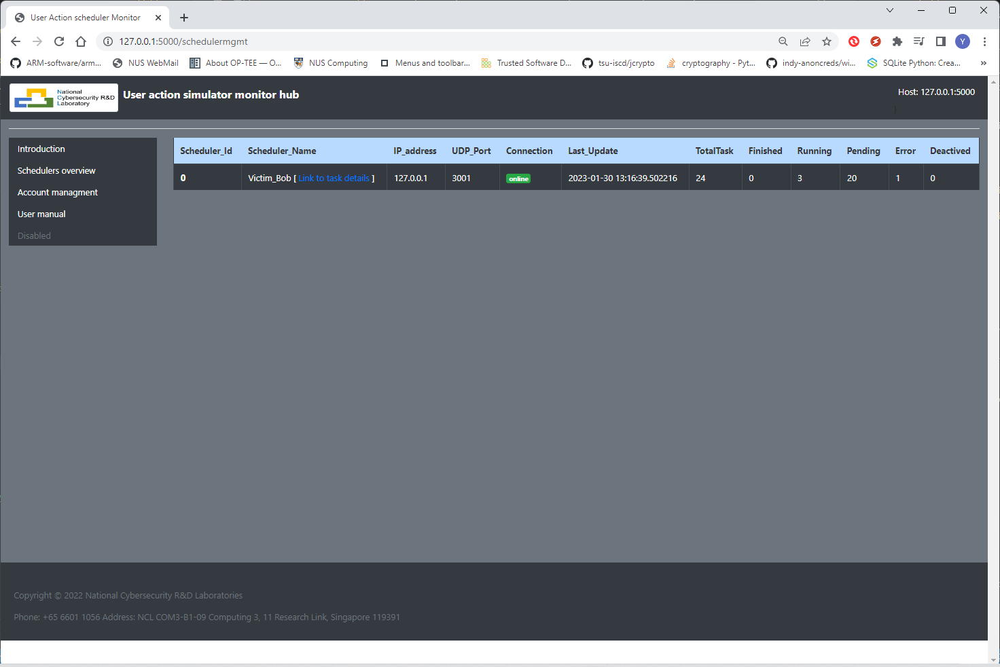
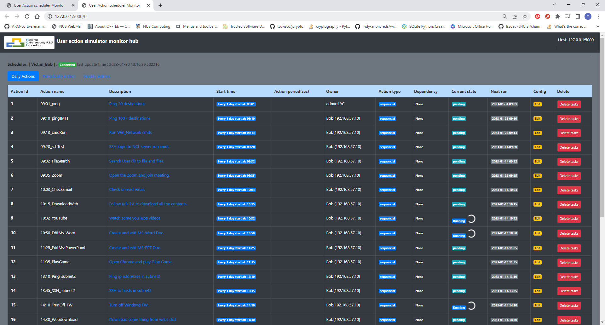

# Scheduler Monitor Hub

[TOC]

### Introduction

The scheduler monitor hub program provide a website for the customer to check each user emulator’s tasks execution state and do some basic control**.** As shown in the workflow diagram section, the user can connect to the monitor hub server to view the webpage or plug their own laptop in the cluster to “Fetch” the emulators’ state basic their local setting.

#### **Schedulers management page**

#### **Scheduler’s tasks management page**

**Emulator’s action monitor web feature:** 

- Each user can customize their own monitor schedulers to be displayed based on their local config setting.
- Tasks management function: task active/deactivate, add new task (under development ), change tasks time schedule(under development).
- The user can plug heir own node with the monitor hub program in the cluster and start to monitor the scheduler they want to check without making any changes of the cluster.

------

> Last edit by LiuYuancheng(liu_yuan_cheng@hotmail.com) at 03/02/2023, if you have any problem or find anu bug, please send me a message .