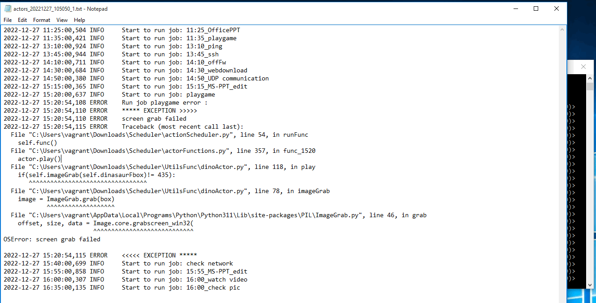
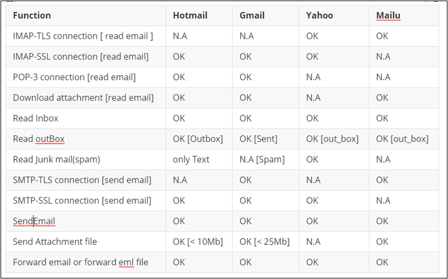

# **Problem and Solution**

**In this document we will share the valuable problems and the solution we meet during the project development as a reference menu for the new programmer who may take over this project for further development. Later we will sort the problem based on the problem <type>.**

[TOC]

**Format:** 

**Problem**: (Situation description)

**OS Platform** :

**Error Message**:

**Type**: Setup exception

**Solution**:

**Related Reference**:

------

##### **Problem** [0]: Install lib error during setup (when run pip install -r requirements.txt) 

**OS Platform** : Windows

**Error Message**: Numpy installation error. 

**Type**: Setup exception

**Solution**: manually run cmd `pip install numpy` to install the latest version.

------

##### **Problem** [1]: Auto play Google dinosaur game error

**OS Platform** : Windows

**Error Message**:

Screen capture error:

**Type**: Usage exception. 

**Solution**: When the user logout remotely, please don't press "lock screen", just close the RDP.

------

##### **Problem** [2]:  UDP files/big message missing part after transferred 

**OS Platform** : Windows / Linux 

**Error Message**: N.A

problem: Added the Big message and file (Size bigger than the UDP buffer size 65,527 bytes ) transfer [send & replay] function.

**Type**: library design problem

**Solution**: 

Please use the bug fixed version of the `UdpCom.py` [**v_0.2**], all API are same as before.

How the new feature added to solve the problem: 

If the message/data size is bigger than the MAX/pre-configured UDP socket buffer size, it will be split to several chunks, each chunk will be buffer size - 1 bytes.

Then the chunk will be sent to destination under the split sequence. The data transfer will follow below steps:

1. Send `b'BM;Send;<messageSize>'` to the server side.

2. Send all chunks in a loop.

3. Send `b'BM;Sent;Finish'` to identify finished and trigger the response.

------

##### **Problem** [3]: Browser actor did not view the YouTube videos. 

**OS Platform** : Windows

**Error Message**: Start Chrome failed. 

**Type**: Chrome driver version not match error. 

**Solution**: 

Check the host machine's Google chrome version, then find the related driver and download from https://chromedriver.chromium.org/downloads

------

##### **Problem** [4]: On/off Win tamper protection after Brain login with 4K screen.

**OS Platform** : Windows

**Error Message**: Screen size not match as the user action mouse+keyboard event is based on 1080P screen resolution. 

**Type**: Usage exception

**Solution**:  Run the version which only use hotkey control to off tamper protection. 

------

##### **Problem** [5]:  Can send email but read email error from the Mailu server

**OS Platform** : Windows

**Error Message**: 

problem: Mailu server use the IMAP-TLS protocol for email fetching which is already not used by most of currently mailbox vendor. 

**Type**: Setup exception

**Solution**: Follow below table when init the email actor to set the related flag: 

------

##### **Problem** [6]: Actor auto edit Word/ppt doc error: file saved but not closed properly 

**OS Platform** : LibreOffice

**Error Message**: N.A

problem: the file content is edit by program and saved, but the file is not closed.

**Type**: Setup error. 

**Solution**:  When use LibreOffice close/open the Ms-word doc, in the tips pop-up window, check the check box "Don't show this message anymore". (The LibreOffice  will show a dialog to let you see next tip when you open/close a file.)

