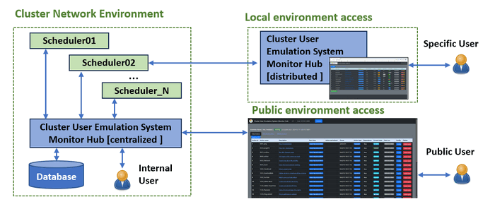
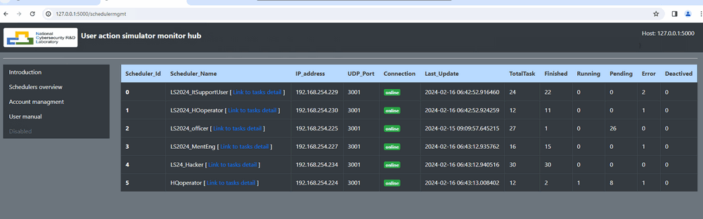
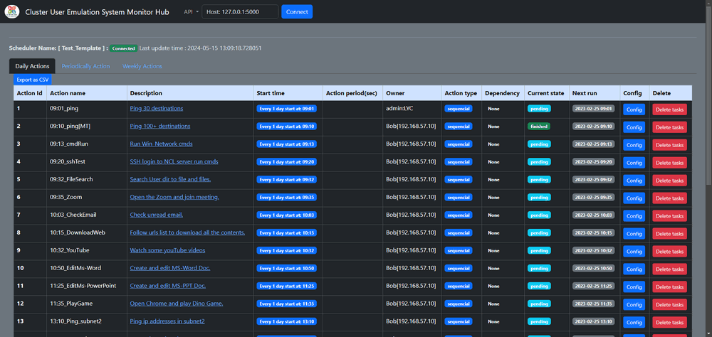
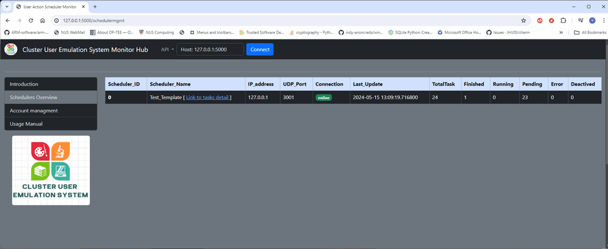
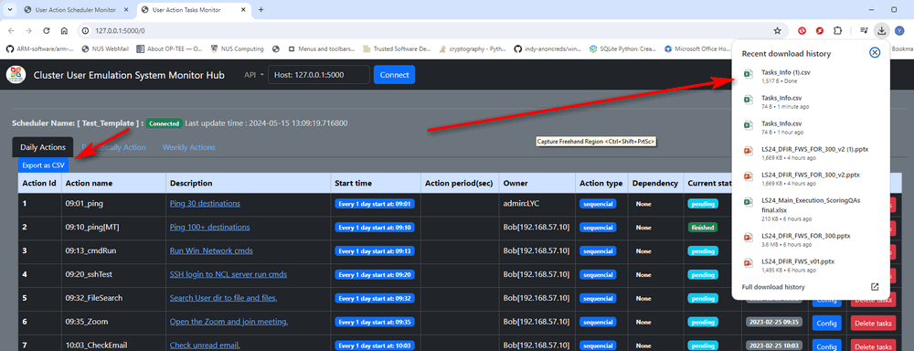
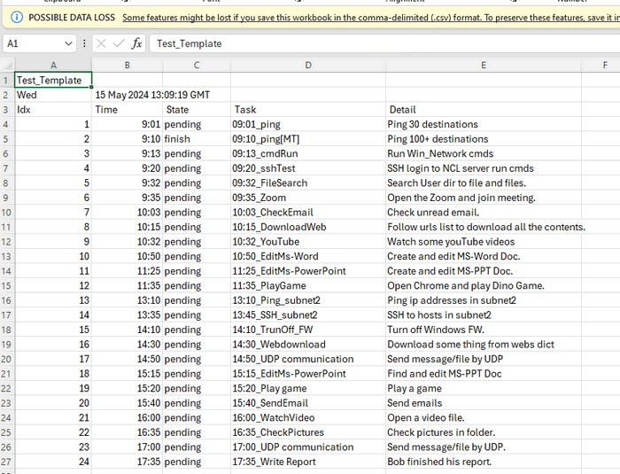

# Cluster User Emulation System Orchestrator 

### - Action Tasks Scheduler Monitor Hub

**Project Design Purpose**: Our objective to develop a centralized database orchestrator program to connect to multiple schedulers programming running in the system to synchronize the schedulers' tasks execution state in real time. The internal can use the API to management the execution of the schedulers. It will also provide a web UI and for customer (public and internal user) to monitor and control all the connected scheduler. It also provides the function for new added in user to set the hub program locally then only monitor the specific scheduler's state. The system overview is shown below:



`Figure-00: CUE Scheduler Monitor Hub System Overview diagram, version v0.2.2 (2024)`

```
version:     v0.2.2
Copyright:   Copyright (c) 2024 LiuYuancheng
License:     MIT License   
```

**Table of Contents**

[TOC]

------

### Introduction

The System Orchestrator is a cloud-based server that aggregates all User Action Emulator's tasks execution states and offers a management website interface for users to monitor and manage the User Action Emulators. The Orchestrator provides two distinct web interfaces:

- **Emulator Procedure Management Interface**: This web dashboard displays comprehensive information about all connected emulators, including their current state and task details. Users can efficiently oversee the execution of tasks across multiple emulators from this interface.
- **Malware Command and Control Interface**: This web dashboard presents the task execution states of all connected malware instances and offers a web API for the red team to dynamically control the malware. This interface empowers red team members with the flexibility to manage malware operations effectively in real-time.


##### Emulator Procedure Management Dashboard

User can view the general state in the emulator procedure management dashboard, the dashboard view is shown below:



`Figure-01: CUE Emulator Procedure Management Dashboard, version v0.2.1 (2023)`

Information detail:

| Title Name       | Description                                                  |
| ---------------- | ------------------------------------------------------------ |
| Scheduler_Id     | Unique ID Action Emulation Scheduler registered in the orchestrator database. |
| Scheduler_Name   | Unique of the Action Emulation Scheduler.                    |
| IP address       | The IP address of the VM which the scheduler is running on.  |
| UDP_Port         | The port to connect to the scheduler to fetch the data.      |
| Connection state | Current scheduler connection state (last 5 min) : online / disconnected. |
| Last update time | The last time stamp orchestrator synchronized with the scheduler. |
| Total Task #     | Number of total tasks set in the scheduler.                  |
| Finished Task #  | Number of finished tasks by the scheduler.                   |
| Running Task #   | Number of task now is executing by the scheduler.            |
| Pending Task #   | Number of task waiting for being execution.                  |
| Error Task #     | Number of task got error during the execution.               |
| De-active Task # | Number of task de-activated by the user.                     |
|                  |                                                              |


##### Action Scheduler Tasks Monitor Dashboard

User can view the detailed individual task execution state in the Action Scheduler Tasks Monitor Dashboard, the dashboard view is shown below:



`Figure-02: Action Scheduler Tasks Monitor Dashboard, version v0.2.3 (2024)`

Information detail:

| Title Name         | Description                                                  |
| ------------------ | ------------------------------------------------------------ |
| Action ID          | Action task unique configured in the scheduler.              |
| Action name        | Action task unique name.                                     |
| Description        | Task short description.                                      |
| Start time         | Time stamp of the task start execution.                      |
| Action period(sec) | Time interval took to finish execute the task.               |
| Owner              | Task Owner: the related owner can control the task from web, admin can control all the task execution. |
| Action type        | Flag to identify whether execute the task in sequence or parallel. |
| Dependency         | Task dependency: whether the task need other task to finish executed then start. |
| Current State      | Task current state: `running` / `pending` / `finished` / `error` / `deactived` |
| Next run           | Next round task execution time                               |
| Config             | Task configure pop-up page button.                           |
| Delete             | Button for user to delete (de-activate) the task.            |
|                    |                                                              |


------

### System Design

[under editing]


------

### Program Setup

##### Development Environment

- python 3.7.10 rc2+ [Windows11]

##### Additional Lib/Software Need

- Flask: https://flask.palletsprojects.com/en/3.0.x/ , install `pip install Flask`
- local lib file : `ConfigLoader.py`, `Log.py`, `udpCom.py`

##### Hardware Needed : None

##### Program Files List 

| Program File                 | Execution Env | Description                                                  |
| ---------------------------- | ------------- | ------------------------------------------------------------ |
| frontend/cueHubApp.py        | python 3.7    | Main website frontend host program to provide the web UI to monitor the scheduler's tasks information and state. |
| frontend/cueHubGlobal.py     | python 3.7    | Module to init the global Constant, parameter, instance of the web app. |
| frontend/dataManage.py       | python 3.7    | Data manager class used to provide specific data fetch and process functions and init the local data storage to store the action scheduler tasks state. |
| frontend/config_template.txt |               | Config file template                                         |
| frontend/templates/*.html    |               | All the webpage html file.                                   |
| frontend/static/*            |               | All the material files(*.css, *.png, *.js) file use by the webpage. |
| frontend/run.bat             |               | Windows web host execution bat file.                         |


------

### Program Usage/Execution

The Orchestrator provide 2 type mode to synchronized the scheduler state. 

- **Fetch Mode**: if the user set the scheduler connection in the config file with `PEER:` tag, the orchestrator will try to connect to the scheduler regularly to fetch the data from the scheduler. 
- **Report Mode**: if the scheduler is configured as report mode, the scheduler will regular update its task execution state to the  Orchestrator. 

##### Set orchestrator configuration file

Re-name the configure file `config_template.txt` to `config.txt` before execute the orchestrator and follow the below example to set the execution parameters:

```
# This is the config file template for the module <cueHubApp.py>
# Setup the paramter with below format (every line follows <key>:<val> format, the
# key can not be changed):

#-----------------------------------------------------------------------------
# Add your connect peer under below format in one line: 
# PEER:{ "name": "<peer_Unique_Name>", "ipAddr": "<IP_v4 address>", "udpPort": <udp_port>, "lkMode":<link mode>}
# Key details:
# name: (necessory) the schduler's unique name. 
# ipAddr : (optional if lkMode > 0) the server's IP address of the schduler
# udpPort : (optional if lkMode > 0) the schduler's UDP Comm port.
# lkMode : (optional default 0) : 
# - 0 fetch mode, hub will fetch state from the schduler via UDP.
# - 1 report mode, the hub will wait the schduler report its state via http. 
# - 2 mixed mode, do both fetch and report.

# Set all the scheduler peer here:
# PEER:{ "name": "Victim_Bob", "ipAddr": "127.0.0.1", "udpPort": 3001, "lkMode": 0 }
# PEER:{ "name": "T1_Alice", "ipAddr": "127.0.0.1", "udpPort": 3002, "lkMode": 0 }
# PEER:{ "name": "T2_Charlie", "ipAddr": "192.168.59.10", "udpPort": 3001, "lkMode":0 }

#-----------------------------------------------------------------------------
# Init the Flask app parameters
FLASK_SER_PORT:5000
FLASK_DEBUG_MD:False
FLASK_MULTI_TH:True
```


##### Run Orchestrator Hub

**Step1**: Run the Orchestrator Hub with below command or double click the `run.bat` file:

```
python3 cueHubApp.py
```

**Step2**: Open the browser and access the URL: http://127.0.0.1:5000/ and select the "Scheduler Overview" : 



`Figure-02: Action Scheduler Tasks Monitor Dashboard, version v0.2.3 (2024)`

**Step3**: Click the `link to task detail` in the table to open a new browser tab to show the task dashboard, to archive the current task state, click the `Export to CSV` button, the current task state table will be converted to an CSV file and download. (as shown below)



The CSV file will flow below example:




------

### Problem and Solution

Refer to `doc/ProblemAndSolution.md`


------

> Last edit by LiuYuancheng(liu_yuan_cheng@hotmail.com) at 15/05/2024, if you have any problem please free to message me.